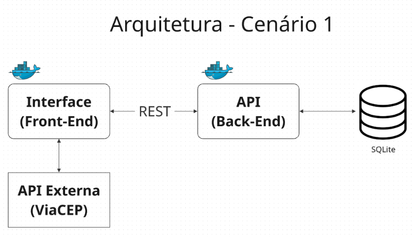

# Minha API REST com Docker

Este pequeno projeto é o MVP da Sprint: Arquitetura de Software (40530010062_20260_01) da pós-graduação Engenharia de Software da PUC-RJ.

O objetivo é apresetar um sistema composto por três módulos que se comunicam, seguindo o padrão REST. O componente externo é o serviço ViaCEP . A persistência de dados é feita utilizando o SQLite. Cada componente desenvolvido possui o seu próprio repositório e, na raiz do repositório, existe um Dockerfile com as instruções que possam garantir a sua execução utilizando containers.

As principais tecnologias que serão utilizadas aqui é o:
 - [Python](https://www.python.org/downloads/)
 - [Nodejs](https://nodejs.org/pt-br/download)
 - [Flask](https://flask.palletsprojects.com/en/2.3.x/)
 - [SQLAlchemy](https://www.sqlalchemy.org/)
 - [OpenAPI3](https://swagger.io/specification/)
 - [SQLite](https://www.sqlite.org/index.html)
 - [Docker para Windows](https://docs.docker.com/desktop/setup/install/windows-install/)
 
---
### Arquitetura do MVP 

 
Interface (Front-End) do Agendamento de Consultas do Trilupet Service que consulta o CEP  utilizando o serviço externo [ViaCEP](https://viacep.com.br/) e que tem um módulo de cadastro  API (Back-End) para efetuar o cadastro de agendamento de consultas e salvar as informações do endereço adquirido pelo CEP.
 
---
### Como Instalar o Projeto através do Docker Desktop

1 - Instalar o Docker, o Python e todas as demais bibliotecas necessárias listadas em "requirements.txt" no seu computador. Também certifique-se de instalar o Node.js e as dependências necessárias para a visualização da interface.

Link para instalação do Docker no Windows:
- Windows: https://docs.docker.com/desktop/install/windows-install/

> Observação: é importante verificar se a virtualização de sua máquina está ativada na BIOS de sua máquina, pois ela é fundamental para habilitação do WSL2. Em seguida, você deve seguir os passos de instalação e habilitação do [WSL2](https://learn.microsoft.com/pt-br/windows/wsl/install), para execução do Docker.
 [verificar virtualização da máquina ativada na BIOS ](https://support.microsoft.com/pt-br/windows/experience/enable-virtualization-on-windows).

 
3 - Certifique-se de ter o Docker instalado e em execução em sua máquina.

Navegue até o diretório que contém o Dockerfile e o requirements.txt no terminal. Por exemplo,

```
cd microservice-viaCep-trilupet_api
```

Execute como administrador o seguinte comando para construir a imagem Docker, por exemplo:

```
docker build -t trilupet-api .
docker run -d -p 5000:5000 --name container_api trilupet-api
```

> Para informações sobre o Docker, veja a [documentação do docker](https://docs.docker.com/engine/reference/run/).

---
### Acesso no browser da API 

Abra o [http://localhost:5000/#/](http://localhost:5000/#/) no navegador para verificar o status da API em execução.

---
### Como Instalar o Projeto na máquina local
1 - Clone o código na sua máquina executando 

```
$ git clone https://github.com/LucianaSAamancio/microservice-viaCep-trilupet_api.git
```

2 - Agora, entre no diretório que foi criado com o passo anterior cd <path_to_directory>

> Se você usa Windows:
Infelizmente, no Windows, o Python 3.10 não pode ser instalado diretamente via terminal no VS Code.

2.1 - Você deve baixar o instalador manualmente:
- [python](https://www.python.org/downloads/release/python-3100/)

2.2 - Depois do download:
- Execute o instalador .exe.+++++
- Marque "Add Python 3.10 to PATH".
- Finalize a instalação.

2.3 - Após isso, no terminal do VS Code digite:
```
$ python --version
$ flask --version
```

> Observação: No Windows abra um terminal como administrador. 

3 - Crie o ambiente virtual:
```
$ python -m venv .venv
```

4 - Ative o ambiente virtual (A partir de agora o SO sabe que tudo que for instalado com o pip install será colocado dentro do ambiente virtual):
```
$ .\.venv\Scripts\activate
```

5 - Dentro da pasta meu_app_api digitar o comando:
```
$ pip install -r requirements.txt
```

> pip -> assistente de instalação do python.  Este comando instala as dependências/bibliotecas, descritas no arquivo requirements.txt.

6 -  Digitar o comando:
```
$ flask run --host 0.0.0.0 --port 5000 --reload
```

> Em modo de desenvolvimento é recomendado executar utilizando o parâmetro reload, que reiniciará o servidor automaticamente após uma mudança no código fonte.

Para executar a API basta executar:
```
$ flask run --host 0.0.0.0 --port 5000
```

7 -  Abra o [link](http://192.168.0.17:5000/) exibido no final no navegador para verificar o status da API em execução.